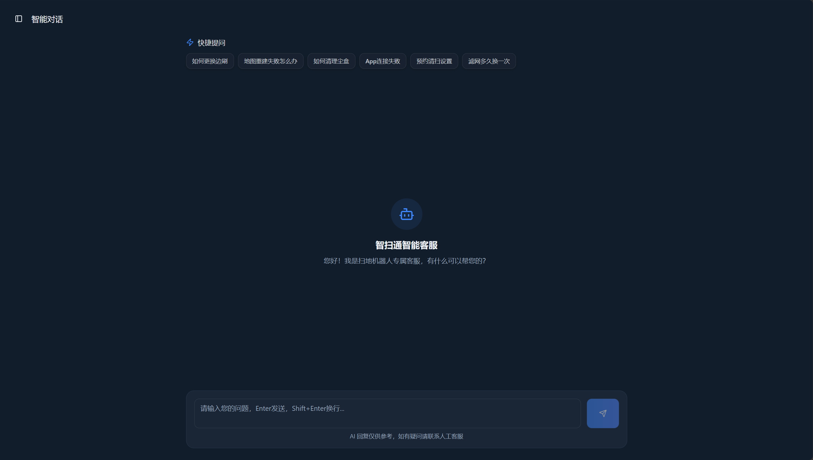
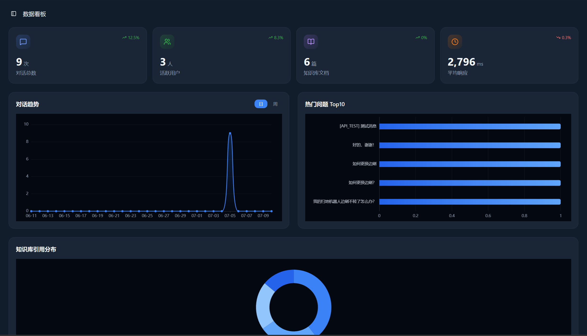
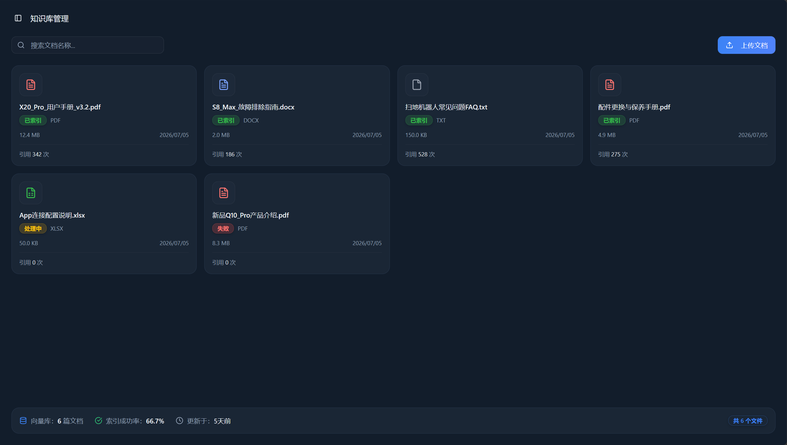
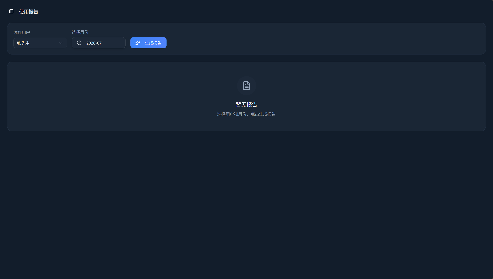
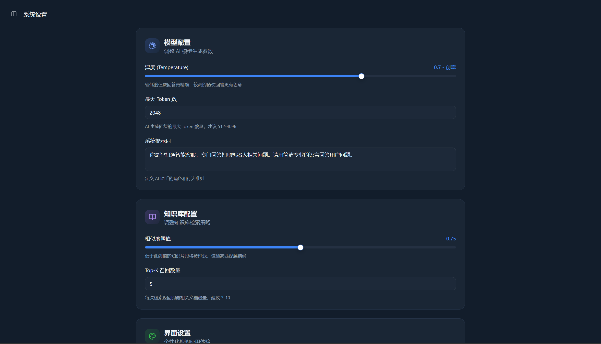
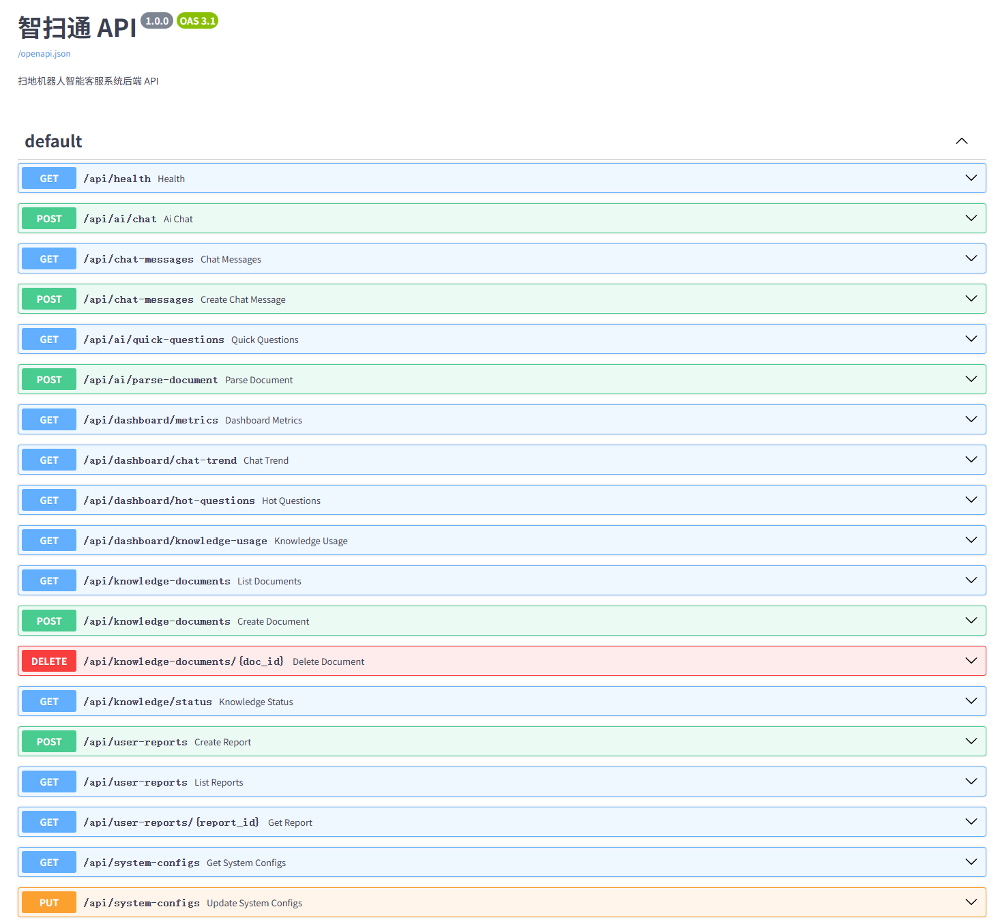

<div align="center">

# 智扫通 · RAG-Agent 智能客服系统

<p align="center">
  
  
  
  
  
  
  
</p>

**基于 RAG 技术的扫地机器人智能客服系统**
后端 Python FastAPI + LangChain + ChromaDB · 前端 React 19 + TypeScript + Vite 7
大语言模型（通义千问 qwen3-max）赋能，使用ReAct思考模式自主对工具的调用，实现从知识库到智能问答的完整闭环。

</div>

---

## 目录

- [界面预览](#界面预览)
- [核心功能](#核心功能)
- [技术栈](#技术栈)
- [项目架构](#项目架构)
- [前后端交互流程](#前后端交互流程)
- [快速开始](#快速开始)
- [API 文档](#api-文档)
- [项目结构](#项目结构)
- [技术亮点](#技术亮点)
- [许可证](#许可证)

---

## 界面预览


| 页面 | 预览 |
|------|------|
| 智能对话 — 与 AI 客服实时对话，支持 SSE 流式响应 |  |
| 数据看板 — ECharts 可视化对话趋势、热门问题排行、知识库引用分布 |  |
| 知识库管理 — 上传 PDF/TXT 文档，自动索引入库 |  |
| 使用报告 — AI 自动生成月度使用报告，含耗材提醒与清洁建议 |  |
| 系统设置 — 支持自定义系统风格，包括模型配置和知识库配置，以及系统的主题颜色和字体大小 |  |
---

## 核心功能

**智能对话**

- RAG 检索增强生成，答案更准确专业
- SSE 流式响应，AI 逐字输出无等待
- 快捷问题栏，一键咨询常见问题

**数据看板**

- ECharts 可视化报表，支持日/周维度切换
- 对话趋势分析、热门问题排行 Top10
- 知识库引用分布饼图
- 核心指标概览卡片（动画过渡）

**知识库管理**

- 支持 PDF / TXT / DOCX / XLSX 文档上传
- 自动索引处理，模拟异步解析
- 搜索筛选、删除管理

**使用报告**

- AI 自动生成月度使用报告
- 使用概览、高频问题、清洁建议、耗材提醒
- 支持 PDF / Excel 导出（预留接口）

**系统设置**

- 模型参数调节（温度、Token 上限、系统提示词）
- 知识库检索策略（相似度阈值、Top-K）
- 界面主题切换（深色/浅色）
- 字体大小调整

---

## 技术栈

| 层级 | 技术 | 版本 |
|------|------|------|
| **前端框架** | React + TypeScript | 19.2 / 5.9 |
| **前端构建** | Vite | 7.3 |
| **前端样式** | TailwindCSS 4 + tw-animate-css | 4.1 |
| **前端 UI** | Radix UI + Lucide Icons + Framer Motion + ECharts | - |
| **后端 API** | Python FastAPI + Uvicorn | 0.139 |
| **AI 引擎** | LangChain + ChatTongyi (qwen3-max) | 0.3 |
| **向量数据库** | ChromaDB + text-embedding-v4 (768维) | 0.6 |
| **共享类型** | TypeScript `shared/api.interface.ts` | - |

---

## 项目架构

```
+------------------------------------------------------------------+
|                   前端 (React + Vite)                              |
|  +----------+  +----------+  +----------+  +------------------+  |
|  | ChatPage |  |Dashboard |  |Knowledge |  | ReportPage       |  |
|  | 智能对话  |  | 数据看板  |  | 知识库管理 |  | 使用报告          |  |
|  +----+-----+  +----+-----+  +----+-----+  +--------+---------+  |
|       |             |              |                 |            |
|       +-------------+--------------+-----------------+            |
|                         |                                         |
|              api_client.ts (HTTP 封装)                             |
|              SSE (streamChatReply)                                 |
|                         v                                         |
|                 +------------------+                              |
|                 |  shared/         |  共享 TypeScript 类型定义      |
|                 |  api.interface.ts|                              |
|                 +------------------+                              |
+---------------------------+--------------------------------------+
                            | HTTP / SSE
                            v
+------------------------------------------------------------------+
|                    后端 (FastAPI)                                  |
|  +------------------------------------------------------------+  |
|  |              api_server.py (主入口)                         |  |
|  |  +----------+ +----------+ +--------------+                |  |
|  |  | AI Chat  | |Dashboard | | Knowledge    |               |  |
|  |  | SSE 流式  | | 指标/趋势 | | 文档 CRUD     |              |  |
|  |  +----------+ +----------+ +--------------+               |  |
|  |  +----------+ +----------+                                |  |
|  |  | Reports  | | System   |                                |  |
|  |  | AI 报告   | | 配置管理  |                                |  |
|  |  +----------+ +----------+                                |  |
|  +------------------------------------------------------------+  |
|                     |                                             |
|          +----------+------------------+                         |
|          v                            v                          |
|  +-------------------+    +----------------------+               |
|  | RAG Engine        |    | AI Agent             |               |
|  | LangChain +       |    | React Agent          |               |
|  | ChromaDB          |    | Agent Tools          |               |
|  +-------------------+    +----------------------+               |
|                                                                  |
|  Mock Data: 50条对话 + 5个文档 + 12份报告 (内置种子数据)          |
+------------------------------------------------------------------+
```

---

## 前后端交互流程

### 1. 智能对话（SSE 流式）

```
用户输入问题 -> ChatPage.handleSend()
                   |
                   +-> saveMessage() [POST /api/chat-messages]
                   |
                   +-> streamChatReply() [POST /api/ai/chat]
                            |
                            v
                     FastAPI StreamingResponse
                            |
                   SSE "data: {content: ...}"
                            |
                            v
                    ChatPage 逐段追加显示
                            |
                   AI 回答完成后保存消息
```

### 2. 数据看板

```
DashboardPage 挂载 -> Promise.all([
  GET /api/dashboard/metrics         -> 总对话量、用户数、文档数、平均响应
  GET /api/dashboard/chat-trend      -> 近30天趋势 (ECharts 折线图)
  GET /api/dashboard/hot-questions   -> Top10 热门问题 (ECharts 横向柱状图)
  GET /api/dashboard/knowledge-usage -> 知识库引用分布 (ECharts 饼图)
])
```

### 3. 知识库管理

```
上传文件 -> createKnowledgeDocument() [POST /api/knowledge-documents]
            -> 异步模拟索引 (2秒后标记 success)
            -> 调用 parseDocument() [POST /api/ai/parse-document]

删除 -> deleteKnowledgeDocument() [DELETE /api/knowledge-documents/{id}]
搜索 -> getKnowledgeDocuments() [GET /api/knowledge-documents?keyword=xxx]
```

### 4. 使用报告

```
选择用户/月份 -> createUserReport() [POST /api/user-reports]
                 -> 异步模拟 AI 生成 (3秒)
                 -> 前台轮询 getUserReport() [GET /api/user-reports/{id}]
                 -> status: generating -> success
```

### 5. API 类型共享

前后端通过 `frontend/shared/api.interface.ts` 共享完整的 TypeScript 接口定义：

```typescript
// 前端任意组件中
import type { ChatMessage, DashboardMetrics } from '@shared/api.interface';
```

---

## 快速开始

### 环境要求

| 工具 | 最低版本 |
|------|----------|
| Python | 3.9+ |
| Node.js | 22.0+ |
| npm | 10.0+ |

### Windows 一键启动

双击 `start.bat`，脚本会自动：

1. 检测运行环境 - Python、Node.js 版本检查
2. 启动后端 - FastAPI 服务器 (端口 8000)
3. 检查前端依赖 - 缺失时自动 npm install
4. 启动前端 - Vite 开发服务器 (端口 8080)

### 手动启动

```bash
# 终端 1: Python 后端
cd backend
set PYTHONPATH=%cd%        # Windows
# export PYTHONPATH=$PWD   # macOS/Linux
python api_server.py

# 终端 2: 前端
cd frontend
npm install --ignore-scripts
set NODE_ENV=development    # Windows
# export NODE_ENV=development  # macOS/Linux
npx vite --config vite.config.ts
```

### 访问地址

| 服务 | 地址 |
|------|------|
| 前端页面 | http://localhost:8080 |
| 后端 API | http://localhost:8000 |
| API 文档 | http://localhost:8000/docs |

---

## API 文档

| 方法 | 端点 | 说明 |
|------|------|------|
| GET | /api/health | 健康检查 |
| POST | /api/ai/chat | AI 对话 (SSE 流式) |
| GET | /api/ai/quick-questions | 快捷问题列表 |
| POST | /api/ai/parse-document | 解析文档 |
| GET | /api/chat-messages | 对话消息列表 (分页) |
| POST | /api/chat-messages | 创建对话消息 |
| GET | /api/dashboard/metrics | 仪表盘概览指标 |
| GET | /api/dashboard/chat-trend | 对话趋势数据 |
| GET | /api/dashboard/hot-questions | 热门问题排行 |
| GET | /api/dashboard/knowledge-usage | 知识库引用分布 |
| GET | /api/knowledge-documents | 知识文档列表 (分页) |
| POST | /api/knowledge-documents | 创建知识文档 |
| DELETE | /api/knowledge-documents/:id | 删除知识文档 |
| GET | /api/knowledge/status | 知识库状态 |
| POST | /api/user-reports | 创建使用报告 |
| GET | /api/user-reports | 报告列表 (分页) |
| GET | /api/user-reports/:id | 报告详情 |
| GET | /api/system-configs | 系统配置 |
| PUT | /api/system-configs | 更新系统配置 |


---

## 项目结构

```
AI/
+-- backend/                       # Python 后端
|   +-- api_server.py              # FastAPI 统一入口（含全部 API + Mock 数据）
|   +-- requirements.txt           # Python 依赖
|   +-- agent/                     # AI Agent 引擎
|   |   +-- agent_tools.py         # Agent 工具函数
|   |   +-- middleware.py          # Agent 中间件
|   |   +-- react_agent.py         # ReAct Agent 实现
|   +-- rag/                       # RAG 检索增强生成
|   |   +-- rag_service.py         # RAG 检索服务
|   |   +-- vector.py              # 向量数据库操作
|   |   +-- vector_store.py        # ChromaDB 封装
|   +-- model/                     # 模型工厂
|   |   +-- factory.py             # 语言模型工厂
|   +-- config/                    # YAML 配置文件
|   +-- data/                      # 知识库原始文档
|   +-- prompts/                   # 提示词模板
|   +-- utils/                     # 工具函数
|
+-- frontend/                      # 前端项目
|   +-- client/                    # React 单页应用
|   |   +-- src/
|   |   |   +-- api/               # API 接口层 (chat/dashboard/knowledge/report/system)
|   |   |   +-- pages/             # 5 个页面组件
|   |   |   |   +-- chat/          # 智能对话 (SSE 流式)
|   |   |   |   +-- dashboard/     # 数据看板 (ECharts)
|   |   |   |   +-- knowledge/     # 知识库管理
|   |   |   |   +-- report/        # 使用报告
|   |   |   |   +-- settings/      # 系统设置
|   |   |   +-- components/        # UI 组件库 (Radix UI + shadcn/ui)
|   |   |   +-- utils/             # 工具函数
|   |   +-- index.html             # 入口 HTML
|   +-- shared/                    # 前后端共享类型
|   |   +-- api.interface.ts       # TypeScript 接口定义
|   +-- server/                    # NestJS 服务端（预留扩展）
|   +-- vite.config.ts             # Vite 构建配置
|
+-- docs/screenshots/              # 截图目录（请自行截图替换）
+-- start.bat                      # Windows 一键启动脚本
+-- start.ps1                      # PowerShell 启动脚本
+-- README.md                      # 项目说明文档
```

---

## 技术亮点

**1. 前后端分离 + 共享类型**

React 19 + FastAPI 高效协作，`shared/api.interface.ts` 定义前后端共享的 TypeScript 接口。前端通过 `@shared` 别名直接引用，彻底杜绝接口字段不一致问题。后端 Pydantic 模型与前端 TS 类型保持语义映射。

**2. RAG 检索增强生成**

LangChain + ChromaDB 实现知识库语义检索。当用户提问时，系统将问题向量化，从 ChromaDB 中召回最相关的知识片段，作为上下文注入 Prompt，大幅提升回答准确率和专业度。

**3. SSE 流式响应**

AI 回答以 Server-Sent Events 逐字符推送至前端，配合 React 状态逐段更新渲染，实现打字机效果。用户无需等待完整回答即可阅读，交互体验自然流畅。

**4. 完整 Mock 数据引擎**

后端内置 50+ 条对话记录、5 个知识文档、12 份月度报告等种子数据，无需大模型 API Key 即可运行体验全部功能。所有 API 端点均返回符合 TypeScript 类型定义的真实结构数据。

**5. 现代化数据可视化**

ECharts 5 + echarts-for-react 实现三大图表：对话趋势折线图（暗色渐变面积）、热门问题横向柱状图（渐变配色）、知识库引用分布环形饼图，支持日/周维度切换。

**6. 类型安全的前端 API 层**

每个业务模块（chat / dashboard / knowledge / report / system）独立封装 API 函数，统一通过 apiClient HTTP 客户端调用。请求/响应均通过 TypeScript 泛型约束，错误处理统一收敛。

**7. AI 自动生成使用报告**

模拟真实 AI 生成流程：用户选择 -> 异步生成（3秒轮询等待）-> 在线展示完整报告（使用概览、高频问题分析、清洁建议、耗材更换提醒）。报告结果以纯前端渲染，视觉风格独立于主应用。

**8. 灵活的系统配置管理**

完整的系统配置 CRUD 接口，支持实时的模型参数调节（温度、Token 数、提示词）与知识库检索策略调整（阈值、Top-K），所有变更即时生效。

---


